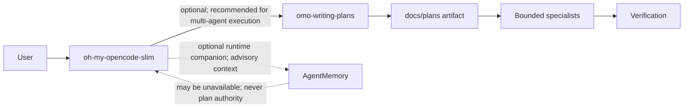

<div align="center">

# omo-writing-plans

**Evidence-based implementation plans before code changes begin.**

An OpenCode skill for multi-step, multi-file, risky, or ambiguous work.

[](LICENSE)
[](https://opencode.ai)

</div>

## Contents

[Purpose](#purpose) · [Problem solved](#problem-solved) · [When to use](#when-to-use) · [Install](#install) · [Workflow](#workflow) · [Usage](#usage) · [Plan artifacts](#plan-artifacts) · [Works With](#works-with) · [Architecture](#architecture) · [Design Influences](#design-influences) · [Project layout](#project-layout) · [Update](#update) · [Uninstall](#uninstall) · [Contributing](#contributing) · [License](#license)

## Purpose

The skill separates planning from execution. It records goal, scope,
repository evidence, acceptance criteria, risks, decisions, bounded tasks, and
validation commands in a durable Markdown artifact.

## Problem solved

Complex changes often start editing before scope, dependencies, ownership, and
verification are explicit. This skill creates a reviewable handoff that keeps
implementation bounded and makes acceptance evidence visible.

## When to use

Use for API changes, migrations, security work, architectural changes,
business-flow changes, parallel-agent work, or any multi-file, risky, or
ambiguous implementation.

Do not use for one clear, low-risk file change with clear acceptance criteria;
use a task card instead. Do not use this skill to create a separate SpecFlow
workflow, task engine, status lifecycle, or execution phase.

## Install

Install globally for OpenCode:

```sh
mkdir -p ~/.config/opencode/skills/omo-writing-plans
cp SKILL.md ~/.config/opencode/skills/omo-writing-plans/SKILL.md
```

From a checked-out repository, run those commands from its root. OpenCode
loads the skill from `~/.config/opencode/skills/omo-writing-plans/SKILL.md`.

## Workflow

1. Read relevant project instructions and source.
2. Confirm goal, scope, non-goals, and observable acceptance criteria.
3. Ask targeted questions when an unresolved decision materially changes
   behavior, API, data, security, or cost.
4. Write one plan at the approved location.
5. Add Behavioral Requirements and Traceability only for auditable, higher-risk
   changes.
6. Request approval before execution only for material impact.
7. Hand approved work to OMO-Slim for dependency-ordered execution, review, and
   verification. Plan-only requests stop after plan output; implementation
   requests proceed unless material risk requires approval.

## Usage

Invoke the `omo-writing-plans` skill when requirements are clear and planning
must precede editing. The resulting plan must begin with the required format:

```markdown
# <Feature> Implementation Plan

## Goal
...
```

Each task states ownership, exact files, dependencies, implementation,
validation, and its observable done condition. Do not invent missing
requirements or speculative APIs.

## Plan artifacts

Plans live at:

```text
docs/plans/YYYY-MM-DD-<feature-name>.md
```

Follow project convention or an explicit user path when one exists. Create the
parent directory only when saving an approved plan.

### Optional auditable sections

Behavioral Requirements use EARS-style wording only when needed:

```text
REQ-1: WHEN <condition>, system SHALL <observable behavior>.
```

When Behavioral Requirements exist, Traceability is required and every
`REQ-*` must map to a task and focused validation. The material approval gate
is required only when the plan affects public API, data model or migration,
authentication or authorization, security posture, external integration,
material cost, or production cutover.

## Works With

These are independent integrations. `omo-writing-plans` does not configure or
require either project.

### [oh-my-opencode-slim](https://github.com/alvinunreal/oh-my-opencode-slim)

Optional, but recommended for multi-agent execution.

- **oh-my-opencode-slim owns:** discovery, orchestration, delegation,
  implementation, review, and verification.
- **omo-writing-plans owns:** plan artifacts only.

The skill creates an approved Markdown plan; oh-my-opencode-slim executes
approved tasks in dependency order. Use `fixer` for mechanical or headless
changes, `designer` for user-visible design, and `oracle` only for high-risk
decisions or review. Preserve explicit file ownership and avoid overlapping
writers.

### [AgentMemory](https://github.com/rohitg00/agentmemory)

AgentMemory is an optional runtime companion of a consumer OMO deployment, not
a repository dependency or plan store. It provides advisory context only and
may be unavailable without blocking planning or execution. Plans and
repository evidence outrank memory; scope, task order, acceptance, status, and
completion evidence remain in the plan and repository.

Memory data is runtime-local or external and must not be committed. Store only
durable, reviewed, source-linked decisions or lessons with project scope. Never
store secrets, credentials, raw transcripts, full plan copies, or temporary
hypotheses.

## Architecture



## Design Influences

This project selectively adopts planning patterns from a local SpecFlow
reference, especially explicit behavior-oriented acceptance thinking.
SpecFlow's approach is informed by broader ideas from
[Kiro specs](https://kiro.dev/docs/specs/) and
[OpenSpec](https://github.com/Fission-AI/OpenSpec). These are design
influences only; this project is not officially affiliated with or endorsed by
those projects.

It deliberately does **not** adopt their full orchestration, lifecycle, or
task-engine systems. This skill provides one Markdown plan and hands approved
execution to OMO-Slim.

## Project layout

```text
.
├── SKILL.md
├── README.md
├── LICENSE
└── .gitignore
```

Consumer repositories add approved artifacts under `docs/plans/`.

## Update

Replace installed skill file with the version from this repository:

```sh
cp SKILL.md ~/.config/opencode/skills/omo-writing-plans/SKILL.md
```

## Uninstall

```sh
rm -rf ~/.config/opencode/skills/omo-writing-plans
```

## Contributing

Keep changes focused on evidence-based planning. Preserve required plan
structure, conditional requirements and traceability rules, approval criteria,
OMO-Slim boundaries, exact-path guidance, and language-neutral behavior. Update
README examples when skill behavior changes. Validate Markdown, frontmatter,
and links before submitting a change.

## License

MIT. See [LICENSE](LICENSE).
